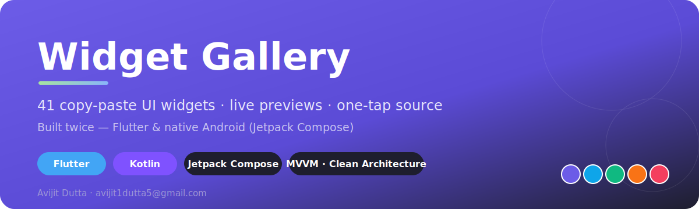
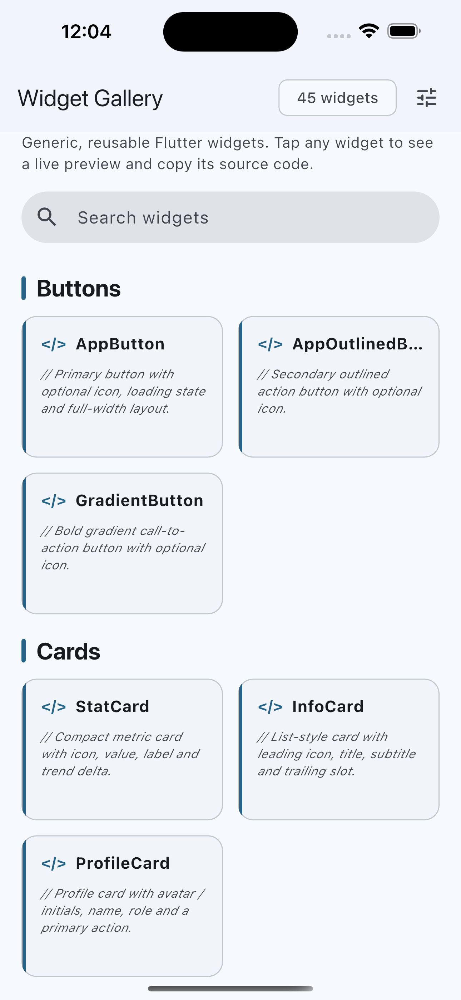
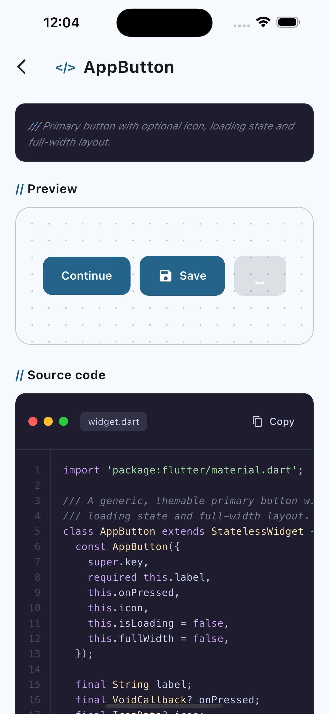
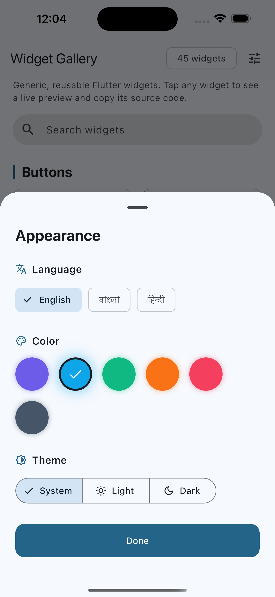
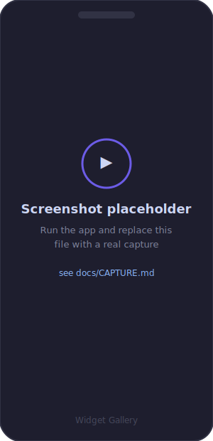

<p align="center">
  
</p>

<p align="center">
  
  
  
  
  
</p>

# 🎨 Widget Gallery

> A polished, copy-paste UI component gallery — built **twice**, once in
> **Flutter** and once in **native Android (Jetpack Compose)** — sharing
> the exact same architecture, design language and feature set.

If you're a developer starting a new app, you shouldn't have to rebuild
buttons, cards, inputs, dialogs and loaders from scratch every time.
Widget Gallery is a living catalogue of **41 production-ready widgets**:
tap any one, see it running, and copy its source straight into your
project.

**Built by [Avijit Dutta](mailto:avijit1dutta5@gmail.com)** ·
📧 avijit1dutta5@gmail.com

---

## 📸 Screenshots & demo

<table>
  <tr>
    <td align="center"><br><sub>Gallery home</sub></td>
    <td align="center"><br><sub>Widget + source</sub></td>
    <td align="center"><br><sub>Language &amp; color</sub></td>
    <td align="center"><br><sub>Dark &amp; flavors</sub></td>
  </tr>
</table>

<p align="center">
  <br>
  <sub>Walkthrough — scroll → open a widget → copy its source</sub>
</p>

> The frames above are placeholders. Capture real screenshots/GIFs with
> the one-liners in **[docs/CAPTURE.md](docs/CAPTURE.md)**, drop them in
> `docs/screenshots/` &amp; `docs/demo/`, then run
> `tools/update_readme_media.sh` to swap the links.

---

## ✨ Why this project is worth a look

This isn't a tutorial app. It's the same product engineered two ways to
show breadth across the two dominant mobile UI stacks:

| | Flutter (Dart) | Native Android (Kotlin) |
|---|---|---|
| UI toolkit | Flutter widgets | Jetpack Compose + Material 3 |
| Location | repository root | [`android_native/`](android_native/) |
| Architecture | MVVM + Clean Architecture | identical |
| State | `ChangeNotifier` | Compose state holders |

Both apps are feature-complete and behave the same.

## 🧩 What's inside

- **41 reusable widgets / 45 gallery entries** across 10 categories —
  Buttons, Cards, Inputs, Feedback, Display, Overlays, Navigation,
  Forms, Layout, Lists.
- **Live, interactive previews** — every widget runs for real, not a
  screenshot.
- **One-tap "copy source"** — the displayed code is *generated from the
  real widget files*, so it never goes stale.
- **3 languages** — English · বাংলা · हिन्दी, switchable instantly.
- **6 color themes** + light / dark / system mode.
- **Syntax-highlighted code view** with line numbers and a code-editor
  look.
- Smooth **entrance & micro animations** throughout.

## 🏗️ Architecture

Clean Architecture with a one-way dependency flow, mirrored in both
codebases:

```
domain/         pure business models, use cases, repository contracts
   ↑
data/           data sources, models, repository implementations
   ↑
presentation/   ViewModels, screens, reusable widgets, theming, i18n
```

Dependency injection is a small hand-written `ServiceLocator` — no
magic, easy to follow in an interview setting.

## 🚀 Run it

**Flutter**

```bash
flutter pub get
flutter run            # any device, emulator or Chrome
flutter analyze        # 0 issues
flutter test           # all tests green
```

**Native Android**

```bash
# Android Studio → Open → select the android_native/ folder
cd android_native
./gradlew installDebug
```

> Requirements: Android Studio (Ladybug+), JDK 17, Android SDK 35.
> Full notes: [`android_native/README.md`](android_native/README.md).

## 🔍 A detail I'm proud of

The "Copy code" button never lies. A small generator reads each widget's
real source file and bakes it into the app, so what you copy is exactly
what renders on screen — across both the Flutter and Kotlin codebases.

## 📫 Contact

**Avijit Dutta** — 📧 [avijit1dutta5@gmail.com](mailto:avijit1dutta5@gmail.com)

If you're a recruiter or engineer reading this, feel free to reach out —
happy to walk through any part of the codebase.

---

<sub>© Avijit Dutta · avijit1dutta5@gmail.com</sub>
